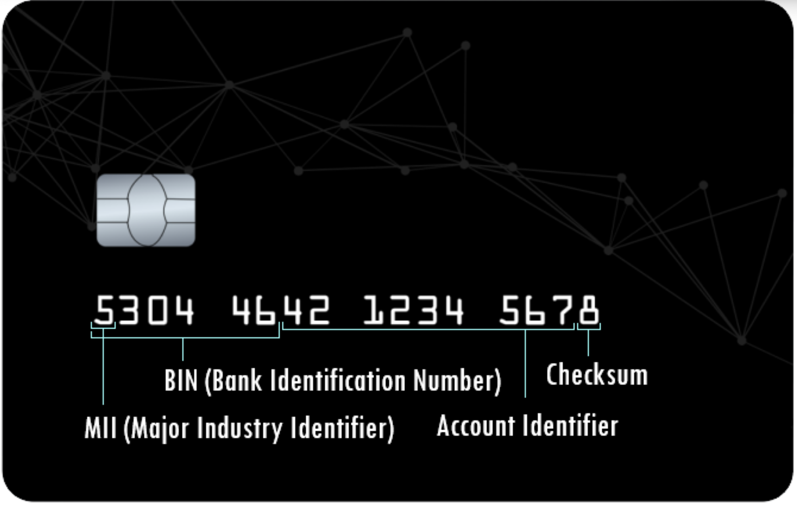
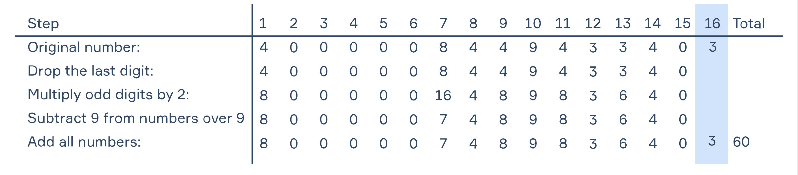

# Work on project Simple Banking System
## Part 1 Description
We live busy lives these days. Between work, chores, and other things on our to-do lists, it can be tough to catch your breath and stay calm. Credit cards are one of the things that save us time, energy, and nerves. From not having to carry a wallet full of cash to consumer protection, cards make our lives easier in many ways. In this project, you will develop a simple banking system with a database.

If you’re curious about business, technology, or how things around you work, you'll probably enjoy learning how credit card numbers work. These numbers ensure easy payments, and they also help prevent payment errors and fraud. Card numbers are evolving, and they might look different in the near future.

Let's take a look at the anatomy of a credit card:

The very first digit is the Major Industry Identifier (MII), which tells you what sort of institution issued the card.

1 and 2 are issued by airlines
3 is issued by travel and entertainment
4 and 5 are issued by banking and financial institutions
6 is issued by merchandising and banking
7 is issued by petroleum companies
8 is issued by telecommunications companies
9 is issued by national assignment
In our banking system, credit cards should begin with 4.

The first six digits are the Issuer Identification Number (IIN). These can be used to look up where the card originated from. If you have access to a list that provides detail on who owns each IIN, you can see who issued the card just by reading the card number.

Here are a few you might recognize:

Visa: 4*****
American Express (AMEX): 34**** or 37****
Mastercard: 51**** to 55****
In our banking system, the IIN must be 400000.

The seventh digit to the second-to-last digit is the customer account number. Most companies use just 9 digits for the account numbers, but it’s possible to use up to 12. This means that using the current algorithm for credit cards, the world can issue about a trillion cards before it has to change the system.

We often see 16-digit credit card numbers today, but it’s possible to issue a card with up to 19 digits using the current system. In the future, we may see longer numbers becoming more common.

In our banking system, the customer account number can be any, but it should be unique. And the whole card number should be 16-digit length.

The very last digit of a credit card is the check digit or checksum. It is used to validate the credit card number using the Luhn algorithm, which we will explain in the next stage of this project. For now, the checksum can be any digit you like.

## Objectives
You should allow customers to create a new account in our banking system.

Once the program starts, you should print the menu:

1. Create an account
2. Log into account
0. Exit
If the customer chooses ‘Create an account’, you should generate a new card number which satisfies all the conditions described above. Then you should generate a PIN code that belongs to the generated card number. The PIN code is a sequence of any 4 digits. PIN should be generated in a range from 0000 to 9999.

If the customer chooses ‘Log into account’, you should ask them to enter their card information. Your program should store all generated data until it is terminated so that a user is able to log into any of the created accounts by a card number and its pin. You can use an array to store the information.

After all information is entered correctly, you should allow the user to check the account balance; right after creating the account, the balance should be 0. It should also be possible to log out of the account and exit the program.

## Example
The symbol > represents the user input. Notice that it's not a part of the input.

1. Create an account
2. Log into account
0. Exit
>1

Your card has been created
Your card number:
4000004938320895
Your card PIN:
6826

1. Create an account
2. Log into account
0. Exit
>2

Enter your card number:
>4000004938320895
Enter your PIN:
>4444

Wrong card number or PIN!

1. Create an account
2. Log into account
0. Exit
>2

Enter your card number:
>4000004938320895
Enter your PIN:
>6826

You have successfully logged in!

1. Balance
2. Log out
0. Exit
>1

Balance: 0

1. Balance
2. Log out
0. Exit
>2

You have successfully logged out!

1. Create an account
2. Log into account
0. Exit
>0

Bye!
# Luhn algorithm
## Part 2 Description
In this stage, we will find out what the purpose of the checksum is and what the Luhn algorithm is used for.

The main purpose of the check digit is to verify that the card number is valid. Say you're buying something online, and you type in your credit card number incorrectly by accidentally swapping two digits, which is one of the most common errors. When the website looks at the number you've entered and applies the Luhn algorithm to the first 15 digits, the result won't match the 16th digit on the number you entered. The computer knows the number is invalid, and it knows the number will be rejected if it tries to submit the purchase for approval, so you're asked to re-enter the number. Another purpose of the check digit is to catch clumsy attempts to create fake credit card numbers. Those who are familiar with the Luhn algorithm, however, could get past this particular security measure.

Luhn Algorithm in action

The Luhn algorithm is used to validate a credit card number or other identifying numbers, such as Social Security. The Luhn algorithm, also called the Luhn formula or modulus 10, checks the sum of the digits in the card number and checks whether the sum matches the expected result or if there is an error in the number sequence. After working through the algorithm, if the total modulus 10 equals zero, then the number is valid according to the Luhn method.

While the algorithm can be used to verify other identification numbers, it is usually associated with credit card verification. The algorithm works for all major credit cards.

Here is how it works for a credit card with the number 4000008449433403:

If the received number is divisible by 10 with the remainder equal to zero, then this number is valid; otherwise, the card number is not valid. When registering in your banking system, you should generate cards with numbers that are checked by the Luhn algorithm. You know how to check the card for validity. But how do you generate a card number so that it passes the validation test? It's very simple!

First, we need to generate an Account Identifier, which is unique to each card. Then we need to assign the Account Identifier to our BIN (Bank Identification Number). As a result, we get a 15-digit number 400000844943340, so we only have to generate the last digit, which is a checksum.

To find the checksum, it is necessary to find the control number for 400000844943340 by the Luhn algorithm. It equals 57 (from the example above). The final check digit of the generated map is 57+X, where X is the checksum. In order for the final card number to pass the validity check, the check number must be a multiple of 10, so 57+X must be a multiple of 10. The only number that satisfies this condition is 3.

Therefore, the checksum is 3. So the total number of the generated card is 4000008449433403. The received card is checked by the Luhn algorithm.

You need to change the credit card generation algorithm so that card numbers pass the Luhn algorithm.

## Objectives
You should allow customers to create a new account in our banking system.

Once the program starts you should print the menu:

1. Create an account
2. Log into the account
0. Exit

If the customer chooses ‘Create an account’, you should generate a new card number that satisfies all the conditions described above. Then you should generate a PIN code that belongs to the generated card number. The PIN is a sequence of 4 digits; it should be generated in the range from 0000 to 9999.

If the customer chooses ‘Log into account’, you should ask to enter the card information.

After the information has been entered correctly, you should allow the user to check the account balance; after creating the account, the balance should be 0. It should also be possible to log out of the account and exit the program.

## Example
The symbol > represents the user input. Notice that it's not a part of the input.

1. Create an account
2. Log into account
0. Exit
>1

Your card has been created
Your card number:
4000004938320896
Your card PIN:
6826

1. Create an account
2. Log into account
0. Exit
>2

Enter your card number:
>4000004938320896
Enter your PIN:
>4444

Wrong card number or PIN!

1. Create an account
2. Log into account
0. Exit
>2

Enter your card number:
>4000004938320896
Enter your PIN:
>6826

You have successfully logged in!

1. Balance
2. Log out
0. Exit
>1

Balance: 0

1. Balance
2. Log out
0. Exit
>2

You have successfully logged out!

1. Create an account
2. Log into account
0. Exit
>0

Bye!

#  I'm so lite.
## Part 3 Description
It's very upsetting when the data about registered users disappears after the program is completed. To avoid this problem, you need to create a database where you will store all the necessary information about the created credit cards. We will use SQLite to create the database.

SQLite is a database engine. It is software that allows users to interact with a relational database. In SQLite, a database is stored in a single file — a trait that distinguishes it from other database engines. This allows for greater accessibility: copying a database is no more complicated than copying the file that stores the data, and sharing a database implies just sending an email attachment.

You can use the sqlite3 module to manage SQLite databases from Python. You don't need to install this module. It is included in the standard library.

To use the module, you must first create a Connection object that represents the database. Here the data will be stored in the example.s3db file:

import sqlite3
conn = sqlite3.connect('example.s3db')
Once you have a Connection, you can create a Cursor object and call its execute() method to perform SQL queries:

cur = conn.cursor()

# Executes some SQL query
cur.execute('SOME SQL QUERY')

# After making some changes in DB don't forget to commit them!
conn.commit()
To get data returned by the SELECT query you can use the methods fetchone() and fetchall():

cur.execute('SOME SELECT QUERY')

# Returns the first row from the response
cur.fetchone()

# Returns all rows from the response
cur.fetchall()
Objectives
In this stage, create a database named card.s3db with a table titled card. It should have the following columns:

id INTEGER
number TEXT
pin TEXT
balance INTEGER DEFAULT 0
Pay attention: your database file should be created when the program starts if it hasn’t yet been created. And all created cards should be stored in the database from now.

Do not forget to commit your DB changes right after executing a query!
## Example
The symbol > represents the user input. Notice that it's not a part of the input.

1. Create an account
2. Log into account
0. Exit
>1

Your card has been created
Your card number:
4000003429795087
Your card PIN:
6826

1. Create an account
2. Log into account
0. Exit
>2

Enter your card number:
>4000003429795087
Enter your PIN:
>4444

Wrong card number or PIN!

1. Create an account
2. Log into account
0. Exit
>2

Enter your card number:
>4000003429795087
Enter your PIN:
>6826

You have successfully logged in!

1. Balance
2. Log out
0. Exit
>1

Balance: 0

1. Balance
2. Log out
0. Exit
>2

You have successfully logged out!

1. Create an account
2. Log into account
0. Exit
>0

Bye!

# Advanced system
## Part 4 Description
You have created the foundation of our banking system. Now let's take the opportunity to deposit money into an account, make transfers and close an account if necessary.

Now your menu should look like this:

1. Balance
2. Add income
3. Do transfer
4. Close account
5. Log out
0. Exit
If the user asks for Balance, you should read the balance of the account from the database and output it into the console.

Add income item should allow us to deposit money to the account.

Do transfer item should allow transferring money to another account. You should handle the following errors:

If the user tries to transfer more money than he/she has, output: Not enough money!
If the user tries to transfer money to the same account, output the following message: You can't transfer money to the same account!
If the receiver's card number doesn’t pass the Luhn algorithm, you should output: Probably you made a mistake in the card number. Please try again!
If the receiver's card number doesn’t exist, you should output: Such a card does not exist.
If there is no error, ask the user how much money they want to transfer and make the transaction.
If the user chooses the Close account item, you should delete that account from the database.

Do not forget to commit your DB changes right after executing a query!
## Examples
The symbol > represents the user input. Notice that it's not a part of the input.

- Example 1:

1. Create an account
2. Log into account
0. Exit
>1

Your card has been created
Your card number:
4000009455296122
Your card PIN:
1961

1. Create an account
2. Log into account
0. Exit
>1

Your card has been created
Your card number:
4000003305160034
Your card PIN:
5639

1. Create an account
2. Log into account
0. Exit
>2

Enter your card number:
>4000009455296122
Enter your PIN:
>1961

You have successfully logged in!

1. Balance
2. Add income
3. Do transfer
4. Close account
5. Log out
0. Exit
>2

Enter income:
>10000
Income was added!

1. Balance
2. Add income
3. Do transfer
4. Close account
5. Log out
0. Exit
>1

Balance: 10000

1. Balance
2. Add income
3. Do transfer
4. Close account
5. Log out
0. Exit
>3

Transfer
Enter card number:
>4000003305160035
Probably you made a mistake in the card number. Please try again!

1. Balance
2. Add income
3. Do transfer
4. Close account
5. Log out
0. Exit
>3

Transfer
Enter card number:
>4000003305061034
Such a card does not exist.

1. Balance
2. Add income
3. Do transfer
4. Close account
5. Log out
0. Exit
>3

Transfer
Enter card number:
>4000003305160034
Enter how much money you want to transfer:
>15000
Not enough money!

1. Balance
2. Add income
3. Do transfer
4. Close account
5. Log out
0. Exit
>3

Transfer
Enter card number:
>4000003305160034
Enter how much money you want to transfer:
>5000
Success!

1. Balance
2. Add income
3. Do transfer
4. Close account
5. Log out
0. Exit
>1

Balance: 5000

1. Balance
2. Add income
3. Do transfer
4. Close account
5. Log out
0. Exit

>0
Bye!

-Example 2:

1. Create an account
2. Log into account
0. Exit
>1

Your card has been created
Your card number:
4000007916053702
Your card PIN:
6263

1. Create an account
2. Log into account
0. Exit
>2

Enter your card number:
>4000007916053702
Enter your PIN:
>6263

You have successfully logged in!

1. Balance
2. Add income
3. Do transfer
4. Close account
5. Log out
0. Exit
>4

The account has been closed!

1. Create an account
2. Log into account
0. Exit
>2

Enter your card number:
>4000007916053702
Enter your PIN:
>6263

Wrong card number or PIN!

1. Create an account
2. Log into account
0. Exit
>0

Bye!
